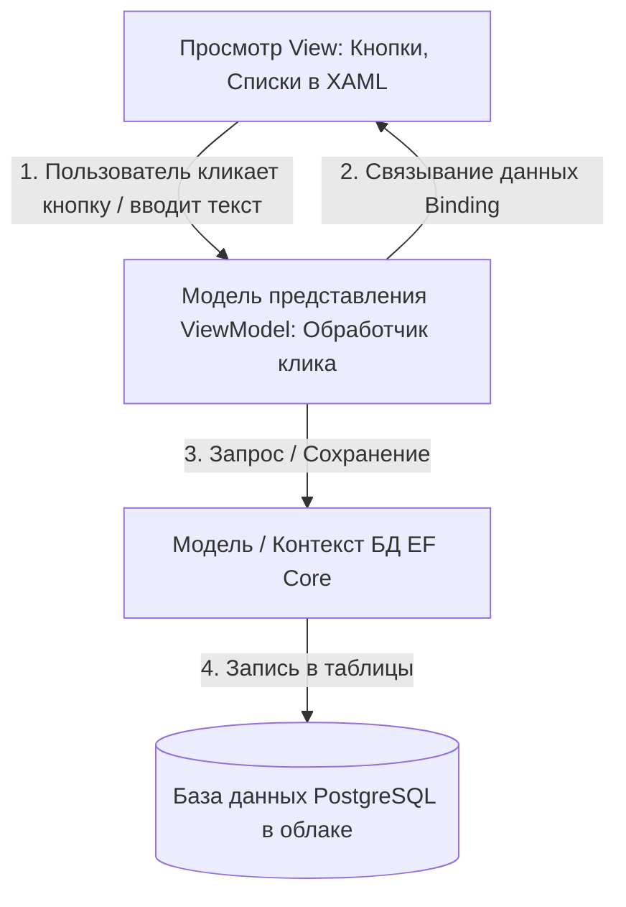
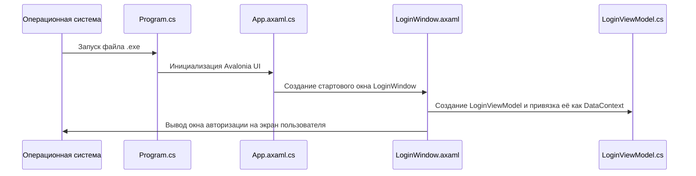
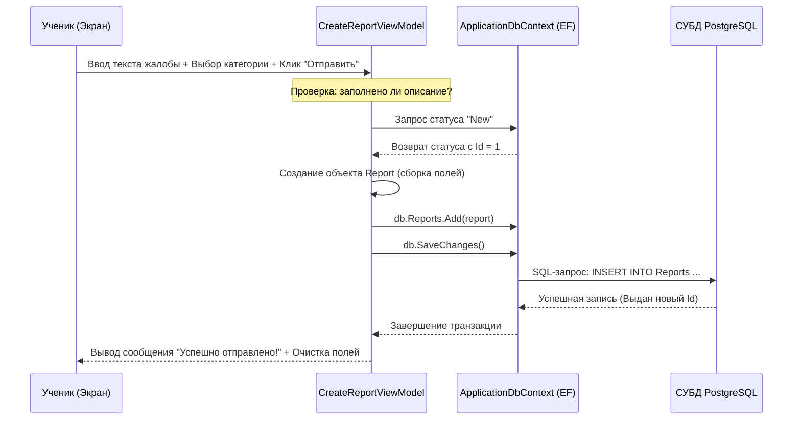

# 📖 Подробное руководство по устройству проекта ReportSystem

Этот документ написан простым языком для людей, которые не занимались разработкой этой программы. Он объясняет, как устроено приложение, какие технологии в нём используются и как они взаимодействуют друг с другом шаг за шагом.

---

## 🧭 Содержание
1. [🧠 Основная идея и назначение приложения](#1-основная-идея-и-назначение-приложения)
2. [🛠 Стек технологий: что это такое простыми словами](#2-стек-технологий-что-это-такое-простыми-словами)
3. [📂 Анатомия папок и файлов (где что лежит)](#3-анатомия-папок-и-файлов-где-что-лежит)
4. [📐 Архитектура MVVM: как связаны логика и внешний вид](#4-архитектура-mvvm-как-связаны-логика-и-внешний-вид)
5. [🗄 Устройство Базы Данных (где хранятся данные)](#5-устройство-базы-данных-где-хранятся-данные)
6. [🔄 Поэтапный разбор работы (Data Flow)](#6-поэтапный-разбор-работы-data-flow)
   - [Процесс 1: Запуск и отображение окна входа](#процесс-1-запуск-и-отображение-окна-входа)
   - [Процесс 2: Авторизация и проверка пароля](#процесс-2-авторизация-и-проверка-пароля)
   - [Процесс 3: Навигация по страницам](#процесс-3-навигация-по-страницам)
   - [Процесс 4: Подача жалобы (Ученик)](#процесс-4-подача-жалобы-ученик)
   - [Процесс 5: Обработка жалоб (Администратор)](#процесс-5-обработка-жалоб-администратор)
7. [⚠️ Важные нюансы реализации (Подводные камни)](#7-важные-нюансы-реализации-подводные-камни)
8. [🚀 Как запустить проект с нуля](#8-как-запустить-проект-с-нуля)

---

## 1. Основная идея и назначение приложения

**ReportSystem** — это цифровая «книга жалоб и предложений» для учебного заведения, оформленная как настольная программа (десктопное приложение). 

### Кому это нужно и как работает?
* **Ученики** могут зайти в программу и сообщить о проблеме (списывание, прогул, хулиганство или буллинг). Они могут сделать это **анонимно** или открыто.
* **Учителя** видят общую статистику происходящего в школе и список поданных жалоб (без имён авторов, если жалоба анонимная).
* **Администраторы** имеют полный доступ: могут менять статус жалобы (например, переводить из «Новая» в «В процессе» или «Решено») и управлять пользователями (менять их роли, например, делать ученика учителем или администратором).

> [!NOTE]
> В отличие от многих современных программ, у этого приложения нет отдельного веб-сайта на сервере (Web Backend). Программа на компьютере напрямую подключается к базе данных в интернете и сама обрабатывает всю логику.

---

## 2. Стек технологий: что это такое простыми словами

Для разработки программы использовались современные инструменты платформы Microsoft .NET. Ниже приведена таблица с расшифровкой каждой технологии:

| Технология | Что это такое простыми словами | Для чего используется в проекте |
| :--- | :--- | :--- |
| **.NET 8.0 & C# 12** | Основная платформа и язык программирования от Microsoft. | На этом языке написан весь внутренний «мозг» программы (логика, вычисления, сохранение данных). |
| **Avalonia UI 11.3** | Современный фреймворк для создания красивых графических интерфейсов. | Позволяет программе работать не только на Windows, но и на macOS и Linux с одним и тем же кодом. |
| **XAML** | Язык разметки интерфейса (похож на HTML). | С его помощью описывается, как выглядят окна: где находятся кнопки, текстовые поля, таблицы и цвета. |
| **MVVM** | Архитектурный подход к проектированию программ. | Делит программу на три независимые части: данные, интерфейс и логику управления интерфейсом. Это делает код аккуратным. |
| **Entity Framework Core 8** | Специальная библиотека-переводчик (ORM). | Избавляет программиста от необходимости писать сложные SQL-запросы к базе данных. Позволяет работать с таблицами базы данных как с обычными списками объектов в C#. |
| **PostgreSQL (Neon)** | Профессиональная реляционная система управления базами данных (СУБД). | Сама база данных физически расположена на облачном сервере **Neon.tech**. В ней хранятся все пользователи, жалобы и настройки. |
| **BCrypt.Net-Next** | Криптографическая библиотека для защиты данных. | Отвечает за безопасность. Благодаря ей пароли пользователей хранятся в зашифрованном виде (в виде «хэша»), который невозможно расшифровать обратно. |

---

## 3. Анатомия папок и файлов (где что лежит)

Если открыть проект в редакторе кода, структура выглядит следующим образом. Ниже подробно расписана роль каждой папки и файла:

* 📁 **`ReportSystem`** (Корневая папка проекта)
  * 📁 **`Models`** — **Модели данных**. Здесь лежат C#-классы, которые описывают структуру таблиц в базе данных.
    * 📄 [User.cs](file:///c:/Projects/ReportsSystem/Models/User.cs) — Описывает пользователя (ФИО, логин, хэш пароля, роль, почта).
    * 📄 [Report.cs](file:///c:/Projects/ReportsSystem/Models/Report.cs) — Описывает саму жалобу (описание, дата создания, статус, автор, модератор).
    * 📄 [Category.cs](file:///c:/Projects/ReportsSystem/Models/Category.cs) — Описывает категории жалоб (например, «Списывание» со своим уровнем важности).
    * 📄 [Evidence.cs](file:///c:/Projects/ReportsSystem/Models/Evidence.cs) — Заготовка под файлы-доказательства (фото, документы).
    * 📄 [Role.cs](file:///c:/Projects/ReportsSystem/Models/Role.cs) — Роли пользователей (Админ, Учитель, Ученик).
    * 📄 [ReportStatus.cs](file:///c:/Projects/ReportsSystem/Models/ReportStatus.cs) — Статусы жалоб (Новая, В работе, Решена, Отклонена).
  * 📁 **`ViewModels`** — **Модели представления**. Это «мозг» каждого экрана. Здесь прописана логика: что происходит при нажатии кнопок, как загружаются списки, как проверяются пароли.
    * 📄 [ViewModelBase.cs](file:///c:/Projects/ReportsSystem/ViewModels/ViewModelBase.cs) — Базовый класс для всех ViewModel.
    * 📄 [LoginViewModel.cs](file:///c:/Projects/ReportsSystem/ViewModels/LoginViewModel.cs) — Управляет экраном входа (проверяет логин/пароль в БД).
    * 📄 [RegisterViewModel.cs](file:///c:/Projects/ReportsSystem/ViewModels/RegisterViewModel.cs) — Управляет экраном регистрации (шифрует пароль и создает аккаунт).
    * 📄 [MainWindowViewModel.cs](file:///c:/Projects/ReportsSystem/ViewModels/MainWindowViewModel.cs) — Главный менеджер: переключает страницы на боковой панели в зависимости от роли вошедшего пользователя.
    * 📄 [DashboardPageViewModel.cs](file:///c:/Projects/ReportsSystem/ViewModels/DashboardPageViewModel.cs) — Собирает статистику для главного экрана (сколько всего жалоб, сколько решено).
    * 📄 [CreateReportViewModel.cs](file:///c:/Projects/ReportsSystem/ViewModels/CreateReportViewModel.cs) — Управляет созданием новой жалобы.
    * 📄 [MyReportsViewModel.cs](file:///c:/Projects/ReportsSystem/ViewModels/MyReportsViewModel.cs) — Показывает ученику список именно его жалоб.
    * 📄 [AdminReportsViewModel.cs](file:///c:/Projects/ReportsSystem/ViewModels/AdminReportsViewModel.cs) — Позволяет админу и учителю видеть все жалобы, искать их по тексту и менять статусы.
    * 📄 [AdminUsersViewModel.cs](file:///c:/Projects/ReportsSystem/ViewModels/AdminUsersViewModel.cs) — Позволяет админу менять роли других пользователей.
  * 📁 **`Views`** — **Представления (Интерфейс)**. Здесь хранятся XAML-файлы, которые отвечают исключительно за внешний вид (кнопки, цвета, верстка) и их парные файлы C# (Code-Behind).
    * Каждый экран представлен парой файлов: визуальный шаблон (`.axaml`) + программная привязка (`.axaml.cs`).
    * 📄 [LoginWindow.axaml](file:///c:/Projects/ReportsSystem/Views/LoginWindow.axaml) / [LoginWindow.axaml.cs](file:///c:/Projects/ReportsSystem/Views/LoginWindow.axaml.cs) — Окно авторизации.
    * 📄 [RegisterWindow.axaml](file:///c:/Projects/ReportsSystem/Views/RegisterWindow.axaml) / [RegisterWindow.axaml.cs](file:///c:/Projects/ReportsSystem/Views/RegisterWindow.axaml.cs) — Окно регистрации.
    * 📄 [MainWindow.axaml](file:///c:/Projects/ReportsSystem/Views/MainWindow.axaml) / [MainWindow.axaml.cs](file:///c:/Projects/ReportsSystem/Views/MainWindow.axaml.cs) — Главное окно программы с боковым меню.
    * 📄 [DashboardPage.axaml](file:///c:/Projects/ReportsSystem/Views/DashboardPage.axaml) / [DashboardPage.axaml.cs](file:///c:/Projects/ReportsSystem/Views/DashboardPage.axaml.cs) — Вкладка статистики.
    * 📄 [CreateReportPage.axaml](file:///c:/Projects/ReportsSystem/Views/CreateReportPage.axaml) / [CreateReportPage.axaml.cs](file:///c:/Projects/ReportsSystem/Views/CreateReportPage.axaml.cs) — Страница написания жалобы.
    * 📄 [MyReportsPage.axaml](file:///c:/Projects/ReportsSystem/Views/MyReportsPage.axaml) / [MyReportsPage.axaml.cs](file:///c:/Projects/ReportsSystem/Views/MyReportsPage.axaml.cs) — Вкладка «Мои жалобы» для ученика.
    * 📄 [AdminReportsPage.axaml](file:///c:/Projects/ReportsSystem/Views/AdminReportsPage.axaml) / [AdminReportsPage.axaml.cs](file:///c:/Projects/ReportsSystem/Views/AdminReportsPage.axaml.cs) — Панель модерации жалоб.
    * 📄 [AdminUsersPage.axaml](file:///c:/Projects/ReportsSystem/Views/AdminUsersPage.axaml) / [AdminUsersPage.axaml.cs](file:///c:/Projects/ReportsSystem/Views/AdminUsersPage.axaml.cs) — Управление пользователями.
  * 📁 **`Data`** — **Слой данных**.
    * 📄 [ApplicationDbContext.cs](file:///c:/Projects/ReportsSystem/Data/ApplicationDbContext.cs) — Самый важный файл для работы с базой данных. Здесь прописана строка подключения к PostgreSQL, настроены связи между таблицами и заданы начальные данные (роли, статусы, категории).
  * 📁 **`Migrations`** — **Миграции**. Автоматически сгенерированные файлы, которые объясняют базе данных PostgreSQL, как создать нужные таблицы и связи.
  * 📄 [Program.cs](file:///c:/Projects/ReportsSystem/Program.cs) — Стартовая точка запуска программы.
  * 📄 [App.axaml](file:///c:/Projects/ReportsSystem/App.axaml) / [App.axaml.cs](file:///c:/Projects/ReportsSystem/App.axaml.cs) — Конфигурация приложения. Именно здесь указывается, что первым делом при запуске должно открываться окно входа.
  * 📄 [ViewLocator.cs](file:///c:/Projects/ReportsSystem/ViewLocator.cs) — Вспомогательный «навигатор», который помогает программе понять: «Если сейчас активна `CreateReportViewModel`, значит на экран нужно вывести шаблон `CreateReportPage.axaml`».

---

## 4. Архитектура MVVM: как связаны логика и внешний вид

Для того чтобы код приложения не превратился в «кашу», используется архитектура **MVVM (Model-View-ViewModel)**. 

### Как это работает на пальцах:
1. **Model (Модель)** — это чистые данные (файлы в папке `Models`). Они ничего не знают про интерфейс и кнопки. Это просто описание структуры: например, у Жалобы есть текст, дата и статус.
2. **View (Представление)** — это картинка (файлы в папке `Views`). Это кнопки, списки, цвета. View «глупая» — в ней нет логики. Она умеет делать только одну вещь: **привязываться (Binding)** к свойствам из ViewModel.
3. **ViewModel (Модель представления)** — это посредник и «мозг» (файлы в папке `ViewModels`). Она забирает данные из базы (Model), форматирует их и выставляет наружу свойства. View подхватывает эти свойства и рисует их.



### Пример связи через Binding (Связывание данных):
В окне создания жалобы [CreateReportPage.axaml](file:///c:/Projects/ReportsSystem/Views/CreateReportPage.axaml) есть текстовое поле ввода:
```xml
<TextBox Text="{Binding Description}" Watermark="Опишите ситуацию во всех подробностях..."/>
```
Это означает: «Всё, что пользователь введёт в это поле на экране, должно автоматически записаться в переменную `Description` внутри класса [CreateReportViewModel.cs](file:///c:/Projects/ReportsSystem/ViewModels/CreateReportViewModel.cs)». Разработчику не нужно писать код переноса текста вручную — технология Avalonia UI делает это сама.

---

## 5. Устройство Базы Данных (где хранятся данные)

База данных — это набор взаимосвязанных таблиц. В нашем проекте используется PostgreSQL. Связи настроены в файле [ApplicationDbContext.cs](file:///c:/Projects/ReportsSystem/Data/ApplicationDbContext.cs).

### Схема таблиц и их связи:

```
Users (Пользователи)
 ├── Id (Первичный ключ)
 ├── FullName (ФИО)
 ├── Login (Уникальный логин)
 ├── PasswordHash (Зашифрованный пароль)
 ├── RoleId (Внешний ключ) ───────────┐
 └── CreatedAt (Дата регистрации)    │
                                     │
Roles (Роли пользователей)           │
 └── Id (Первичный ключ) <───────────┘
     (Значения: 1=Admin, 2=Teacher, 3=Student)

Categories (Категории нарушений)
 ├── Id (Первичный ключ) <───────────┐
 ├── Name (Например, "Буллинг")      │
 └── SeverityLevel (Уровень тяжести) │
                                     │
Reports (Жалобы о нарушениях)       │
 ├── Id (Первичный ключ)             │
 ├── AuthorId (Кто создал) ──────────┼───> Ссылка на Users.Id
 ├── CategoryId (Категория) ─────────┘
 ├── Description (Описание проблемы)
 ├── StatusId (Статус) ──────────────┐
 ├── IsAnonymous (Анонимно?)         │
 ├── CreatedAt (Дата создания)       │
 ├── ReviewedById (Кто проверил) ────┼───> Ссылка на Users.Id (может быть пустым)
 └── ResolvedAt (Дата решения)       │
                                     │
ReportStatuses (Статусы жалоб)       │
 └── Id (Первичный ключ) <───────────┘
     (Значения: 1=New, 2=InProgress, 3=Resolved, 4=Rejected)
```

> [!IMPORTANT]
> **Сложная связь (Двойной ключ):**
> Обратите внимание, что таблица жалоб `Reports` дважды ссылается на таблицу пользователей `Users`:
> 1. `AuthorId` — указывает на ученика, который написал жалобу.
> 2. `ReviewedById` — указывает на администратора или учителя, который взял жалобу в работу или закрыл её.
> Чтобы база данных понимала, кто есть кто, в файле [ApplicationDbContext.cs](file:///c:/Projects/ReportsSystem/Data/ApplicationDbContext.cs) эти связи прописаны вручную через специальный инструмент **Fluent API** (строки 25-33).

---

## 6. Поэтапный разбор работы (Data Flow)

Давайте проследим путь данных на конкретных примерах использования приложения.

### Процесс 1: Запуск и отображение окна входа



1. Когда пользователь кликает по иконке программы, управление передается в [Program.cs](file:///c:/Projects/ReportsSystem/Program.cs).
2. Настраивается графический движок, и управление переходит в [App.axaml.cs](file:///c:/Projects/ReportsSystem/App.axaml.cs) в метод `OnFrameworkInitializationCompleted`.
3. Этот метод создает объект окна [LoginWindow](file:///c:/Projects/ReportsSystem/Views/LoginWindow.axaml) и делает его главным окном приложения.
4. Внутри конструктора [LoginWindow.axaml.cs](file:///c:/Projects/ReportsSystem/Views/LoginWindow.axaml.cs) создается объект логики [LoginViewModel](file:///c:/Projects/ReportsSystem/ViewModels/LoginViewModel.cs) и привязывается к окну (`DataContext = vm`).

---

### Процесс 2: Авторизация и проверка пароля

1. Пользователь вводит в поля ввода логин (например, `danil`) и пароль (`12345`) и нажимает кнопку **«Войти»**.
2. По нажатию кнопки срабатывает команда `LoginCommand` в классе [LoginViewModel.cs](file:///c:/Projects/ReportsSystem/ViewModels/LoginViewModel.cs).
3. Происходит обращение к базе данных через Entity Framework Core:
   ```csharp
   using var db = new ApplicationDbContext();
   var user = db.Users.Include(u => u.Role).FirstOrDefault(u => u.Login == Login);
   ```
   *Простыми словами: программа просит базу данных найти пользователя, у которого колонка `Login` совпадает с тем, что ввёл человек.*
4. **Проверка безопасности:** Пароли в базе данных хранятся в виде нечитаемых строк (хэшей), например: `$2a$11$abc123xyz...`. Программа берёт введённый пароль `12345` и отправляет его в библиотеку **BCrypt**:
   ```csharp
   BCrypt.Net.BCrypt.Verify(Password, user.PasswordHash)
   ```
   *BCrypt специальным образом преобразует `12345` и сравнивает его с хэшем из БД. Если они соответствуют друг другу, проверка пройдена.*
5. Если проверка успешна, ViewModel генерирует сигнал `LoginSucceeded`.
6. Окно [LoginWindow.axaml.cs](file:///c:/Projects/ReportsSystem/Views/LoginWindow.axaml.cs) ловит этот сигнал, закрывает само себя и открывает главное окно [MainWindow](file:///c:/Projects/ReportsSystem/Views/MainWindow.axaml), передавая туда данные вошедшего пользователя.

---

### Процесс 3: Навигация по страницам

Как программа понимает, какие кнопки меню показывать администратору, а какие — ученику?

1. При открытии главного окна создается [MainWindowViewModel](file:///c:/Projects/ReportsSystem/ViewModels/MainWindowViewModel.cs).
2. Во ViewModel определены свойства-проверки:
   * `IsAdmin` (проверяет, равна ли роль пользователя "Admin")
   * `IsStudent` (проверяет, равна ли роль "Student")
   * `IsTeacher` (проверяет, равна ли роль "Teacher")
3. В файле разметки [MainWindow.axaml](file:///c:/Projects/ReportsSystem/Views/MainWindow.axaml) кнопки бокового меню сгруппированы в панели, видимость которых жестко привязана к ролям:
   ```xml
   <!-- Панель для ученика -->
   <StackPanel IsVisible="{Binding IsStudent}">
       <Button Name="NavDashboard" Content="Дашборд" />
       <Button Name="NavCreate" Content="Создать жалобу" />
       <Button Name="NavMy" Content="Мои жалобы" />
   </StackPanel>
   ```
   Благодаря этому ученик физически не увидит кнопки управления пользователями или чужими жалобами.
4. Когда пользователь кликает по кнопке меню, в [MainWindow.axaml.cs](file:///c:/Projects/ReportsSystem/Views/MainWindow.axaml.cs) срабатывает обработчик клика, который меняет индекс выбранного меню (`SelectedMenuIndex`).
5. Метод `NavigateTo(index)` во ViewModel создает нужную ViewModel страницы (например, [CreateReportViewModel](file:///c:/Projects/ReportsSystem/ViewModels/CreateReportViewModel.cs)) и записывает её в свойство `CurrentPage`.
6. Навигационный класс [ViewLocator.cs](file:///c:/Projects/ReportsSystem/ViewLocator.cs) автоматически видит изменение `CurrentPage`, находит парный XAML-файл представления (например, `CreateReportPage.axaml`) и динамически отрисовывает его в центре экрана.

---

### Процесс 4: Подача жалобы (Ученик)



1. Ученик открывает страницу создания жалобы. Программа загружает из базы данных список категорий нарушений и выводит их в выпадающий список (ComboBox).
2. Ученик пишет описание происшествия, выбирает категорию, при желании ставит галочку «Подать анонимно» и нажимает кнопку **«Отправить»**.
3. Срабатывает метод `SubmitReport` в [CreateReportViewModel.cs](file:///c:/Projects/ReportsSystem/ViewModels/CreateReportViewModel.cs):
   - Программа проверяет, не пустое ли описание.
   - Ищет в БД статус `New` (чтобы присвоить его новой жалобе).
   - Создает объект `Report` и заполняет его поля:
     - `AuthorId` = ID вошедшего ученика.
     - `CategoryId` = ID выбранной категории.
     - `Description` = текст жалобы.
     - `IsAnonymous` = `true` или `false` (в зависимости от галочки).
     - `StatusId` = ID статуса `New` (равен 1).
     - `CreatedAt` = текущее время (`DateTime.UtcNow`).
4. Объект добавляется в контекст базы данных и сохраняется:
   ```csharp
   db.Reports.Add(report);
   db.SaveChanges();
   ```
5. EF Core преобразует этот объект в SQL-запрос `INSERT` и отправляет его на облачный сервер Neon.tech.
6. Данные сохраняются, ученику выводится зелёная надпись «Обращение успешно отправлено!», а поля ввода очищаются для новой записи.

---

### Процесс 5: Обработка жалоб (Администратор)

1. Администратор переходит во вкладку «Жалобы» (`AdminReportsPage`).
2. В классе [AdminReportsViewModel.cs](file:///c:/Projects/ReportsSystem/ViewModels/AdminReportsViewModel.cs) срабатывает метод `LoadReports()`.
3. Выполняется сложный запрос в БД: загружаются жалобы, к ним присоединяются данные об их текущем статусе, авторе жалобы и её категории:
   ```csharp
   var query = db.Reports.Include(r => r.Status).AsEnumerable();
   ```
4. Если администратор ввёл текст в строку поиска или выбрал фильтр по статусу (например, «В процессе»), список фильтруется на лету.
5. Загруженные жалобы отображаются на экране в виде таблицы (DataGrid).
   * **Логика анонимности:** Если жалоба анонимная (`IsAnonymous = true`), то в интерфейсе вместо реального ФИО ученика выводится слово **«Анонимно»** (это настроено в дизайне XAML-страницы).
6. Администратор выделяет строчку в таблице и нажимает, например, кнопку **«В работу»** или **«Решено»**.
7. Вызывается метод `ChangeStatus` с передачей имени нового статуса:
   - Из таблицы статусов извлекается нужный статус (например, `Resolved` с ID = 3).
   - В БД обновляется поле `StatusId` у выбранной жалобы.
   - Если статус меняется на `Resolved` (Решено) или `Rejected` (Отклонено), программа автоматически записывает в поле `ResolvedAt` текущее время (время закрытия жалобы).
   - Метод `db.SaveChanges()` отправляет команду обновления `UPDATE` в базу данных.
   - Список на экране обновляется, показывая новые статусы.

---

## 7. Важные нюансы реализации (Подводные камни)

Если вы будете сдавать или демонстрировать этот проект, обратите внимание на две важные детали в кодовой базе, о которых вас могут спросить:

### 1. Заготовка под доказательства ( evidencias )
* **Как устроено в базе:** В проекте есть модель [Evidence.cs](file:///c:/Projects/ReportsSystem/Models/Evidence.cs) и соответствующая таблица в PostgreSQL. Она предназначена для хранения ссылок на файлы-доказательства нарушений (например, фотографии списывания).
* **Как это работает в реальности:** В текущей версии графического интерфейса (UI) **нет** кнопок для выбора и прикрепления файлов.
* **Что отвечать на вопросы:** *«База данных полностью спроектирована с учетом поддержки файлов-доказательств. Интерфейс для загрузки файлов находится в стадии разработки и запланирован на следующую версию продукта»*.

### 2. Фильтрация данных в оперативной памяти (`AsEnumerable`)
* **Как устроено в коде:** При поиске жалоб программа сначала выгружает все записи из базы данных в память компьютера с помощью метода `.AsEnumerable()`, а затем фильтрует их средствами C# (`query.Where(...)`).
* **Почему так сделано:** Это самый простой способ сделать регистронезависимый поиск на русском языке (чтобы слова «буллинг», «Буллинг» и «БУЛЛИНГ» находились одинаково хорошо) без настройки сложных конфигураций на самом сервере PostgreSQL.
* **Как оптимизировать в будущем:** Для больших баз данных с миллионами записей это будет работать медленно (так как компьютер будет скачивать всю базу данных при каждом поиске). В будущем этот поиск нужно перенести на сторону базы данных с помощью SQL-команды `ILIKE` или полнотекстового поиска PostgreSQL.

---

## 8. Как запустить проект с нуля

Для запуска проекта на любом компьютере выполните следующие шаги:

### Шаг 1: Установка необходимых программ
1. Установите **.NET 8.0 SDK** (это базовый пакет разработчика C# от Microsoft).
2. Установите среду разработки: **Visual Studio 2022**, **JetBrains Rider** или **VS Code** с плагинами для C#.

### Шаг 2: Настройка подключения к базе данных
Строка подключения к базе данных находится в файле [ApplicationDbContext.cs](file:///c:/Projects/ReportsSystem/Data/ApplicationDbContext.cs) в методе `OnConfiguring`:
```csharp
optionsBuilder.UseNpgsql("Host=ep-solitary-thunder-aqe0nh0x-pooler.c-8.us-east-1.aws.neon.tech;Database=neondb;Username=neondb_owner;Password=npg_SodbwOi1JPh4;SSL Mode=Require;Trust Server Certificate=true");
```
В данный момент там прописана работающая облачная база данных на Neon.tech. Если вы хотите использовать свою базу:
1. Замените эту строку на параметры вашей СУБД PostgreSQL.
2. Откройте терминал в папке проекта и выполните команду для создания таблиц:
   ```bash
   dotnet ef database update
   ```
   *EF Core автоматически создаст все таблицы и заполнит их начальными ролями, статусами и категориями жалоб.*

### Шаг 3: Запуск приложения
Запустите проект из вашей среды разработки (нажав зеленую кнопку воспроизведения «Play»), либо через терминал командой:
```bash
dotnet run
```

---

## 📚 Шпаргалка: Краткий глоссарий для не-программиста

* **База данных (БД)** — электронный склад информации. Хранит данные в виде упорядоченных таблиц с колонками и строками.
* **Миграция** — чертёж/инструкция для создания или изменения структуры базы данных на основе C#-кода.
* **Хэш пароля** — результат шифрования пароля. Из хэша невозможно восстановить исходный пароль. При входе программа сверяет хэш введённого пароля с хэшем, хранящимся в БД.
* **Контекст данных (DbContext)** — главный объект в программе C#, через который происходит общение с базой данных (добавление, удаление, изменение записей).
* **Binding (Связывание)** — живая связь между визуальным элементом на экране (например, галочкой анонимности) и переменной в кодовой логике. Если меняется одно, автоматически меняется и другое.
