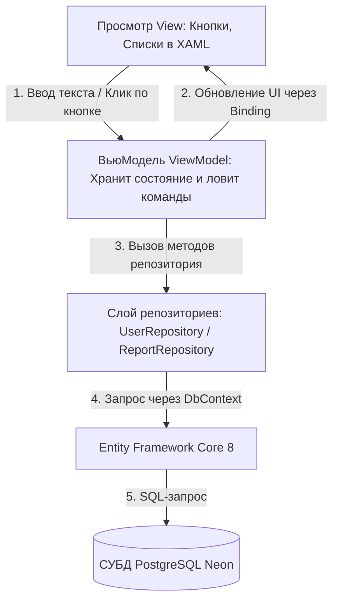
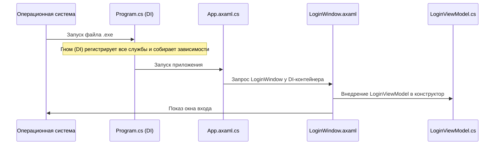
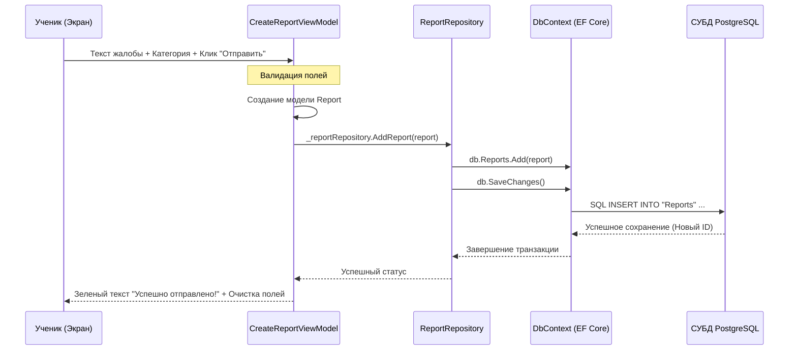

# 📘 Полная техническая документация и руководство по защите курсового проекта: Система мониторинга нарушений

Данный документ представляет собой исчерпывающее описание архитектуры, структуры базы данных, логики работы и ключевых процессов приложения **ReportSystem**. Он разработан специально для подготовки к защите курсовой работы и объясняет работу приложения «под капотом» в мельчайших деталях (включая простые жизненные аналогии, Mermaid-диаграммы и разбор кода).

---

## 🧭 Содержание
1. [🧠 Основная идея и назначение приложения](#1-основная-идея-и-назначение-приложения)
2. [🧸 Сложные понятия на простых детских примерах (Объясняем «для самых маленьких»)](#2-сложные-понятия-на-простых-детских-примерах-объясняем-для-самых-маленьких)
3. [🛠 Стек технологий: что это такое простыми словами](#3-стек-технологий-что-это-такое-простыми-словами)
4. [📂 Анатомия папок и файлов (где что лежит)](#4-анатомия-папок-и-файлов-где-что-лежит)
5. [📐 Архитектура MVVM: как связаны логика и внешний вид](#5-архитектура-mvvm-как-связаны-логика-и-внешний-вид)
6. [🗄 Устройство Базы Данных (где хранятся данные)](#6-устройство-базы-данных-где-хранятся-данные)
7. [🔄 Поэтапный разбор работы (Data Flow)](#7-поэтапный-разбор-работы-data-flow)
8. [⚠️ Важные нюансы реализации (Подводные камни)](#8-важные-нюансы-реализации-подводные-камни)
9. [🎓 Шпаргалка для защиты (Ответы на возможные вопросы комиссии)](#9-шпаргалка-для-защиты-ответы-на-возможные-вопросы-комиссии)
10. [🚀 Как запустить проект с нуля](#10-как-запустить-проект-с-нуля)

---

## 1. Основная идея и назначение приложения

**ReportSystem** — это цифровая «книга жалоб и предложений» для учебного заведения, оформленная как настольная программа (десктопное приложение). 

### Кому это нужно и как работает?
* **Ученики** могут зайти в программу и сообщить о проблеме (списывание, прогул, хулиганство или буллинг). Они могут сделать это **анонимно** или открыто.
* **Учителя** видят общую статистику происходящего в школе и список поданных жалоб (без имён авторов, если жалоба анонимная).
* **Администраторы** имеют полный доступ: могут менять статус жалобы (например, переводить из «Новая» в «В процессе» или «Решено») и управлять пользователями (менять их роли и удалять аккаунты).

---

## 2. Сложные понятия на простых детских примерах (Объясняем «для самых маленьких»)

Если преподаватель спросит вас на защите про архитектуру, репозитории или DI, расскажите ему эти истории:

### 🗄️ Паттерн «Репозиторий» (Repository Pattern)
> **Детская аналогия:** Представьте ресторан. Раньше повар (**ViewModel**) сам бегал на грязный склад (**базу данных EF Core**), таскал мешки с картошкой, мыл её и чистил. Это занимало много времени, и повар пачкал руки. 
> 
> Теперь мы наняли кладовщика (**Репозиторий**). Повар просто говорит кладовщику: *«Принеси мне 3 чистые картошины»*. Кладовщик сам идёт на склад, разбирается с мешками и приносит готовый продукт на блюдечке. Повар занимается только готовкой (логикой отображения).
>
> **В коде:** [UserRepository.cs](file:///c:/Projects/ReportsSystem/Data/Repositories/UserRepository.cs) и [ReportRepository.cs](file:///c:/Projects/ReportsSystem/Data/Repositories/ReportRepository.cs) берут на себя всю работу с СУБД, а ViewModels получают уже готовые чистые объекты.

### 🔌 Внедрение зависимостей (Dependency Injection)
> **Детская аналогия:** Представьте игрушечную машинку на пульте управления (**ViewModel**). Чтобы она поехала, ей нужны батарейки (**Репозитории**). 
> 
> *Без DI* машинка должна была бы сама как-то вырастить в себе батарейки или искать их по дому (создавать через `new UserRepository()`). 
> 
> *С DI* мы просто делаем в машинке отсек для батареек (конструктор класса). И у нас есть умный гном-помощник (**DI-контейнер**). Когда мы достаем машинку из коробки, гном сам смотрит, какие батарейки ей нужны, берет их из своей коробки с припасами и вставляет в машинку. Машинка сразу готова к работе!
>
> **В коде:** Все регистрации лежат в [Program.cs](file:///c:/Projects/ReportsSystem/Program.cs). Гном (контейнер) автоматически собирает классы вместе при запуске.

### 🗺️ ViewLocator (Поиск комнат)
> **Детская аналогия:** У нас есть ключи от комнат (**ViewModels**) и сами комнаты (**Views** / Экранчики XAML). Чтобы мы не путались, на каждом ключе написано имя комнаты, к которой он подходит (например, на ключе `DashboardViewModel` написано слово `DashboardView`). 
> 
> Наш дворецкий (**ViewLocator**) берёт ключ, смотрит на надпись, мгновенно понимает, какую комнату нужно открыть, строит её и запускает нас внутрь.
>
> **В коде:** [ViewLocator.cs](file:///c:/Projects/ReportsSystem/ViewLocator.cs) автоматически находит XAML-файл по имени C#-класса с помощью рефлексии.

---

## 3. Стек технологий: что это такое простыми словами

| Технология | Что это такое простыми словами | Для чего используется в проекте |
| :--- | :--- | :--- |
| **.NET 8.0 & C# 12** | Основная платформа и язык программирования от Microsoft. | На этом языке написан весь внутренний «мозг» программы (логика, вычисления, сохранение данных). |
| **Avalonia UI 11.3** | Современный фреймворк для создания красивых графических интерфейсов. | Позволяет программе работать не только на Windows, но и на macOS и Linux с одним и тем же кодом. |
| **XAML** | Язык разметки интерфейса (похож на HTML). | С его помощью описывается, как выглядят окна: где находятся кнопки, текстовые поля, таблицы и цвета. |
| **Microsoft.Extensions.Hosting** | Встроенный менеджер зависимостей (DI-контейнер). | Управляет временем жизни классов и автоматически собирает дерево зависимостей. |
| **Entity Framework Core 8** | Специальная библиотека-переводчик (ORM). | Избавляет программиста от необходимости писать сложные SQL-запросы к базе данных. Позволяет работать с таблицами базы данных как с обычными списками объектов в C#. |
| **PostgreSQL (Neon)** | Профессиональная реляционная СУБД. | Сама база данных физически расположена на облачном сервере **Neon.tech**. В ней хранятся все пользователи, жалобы и настройки. |
| **BCrypt.Net-Next** | Криптографическая библиотека для защиты данных. | Отвечает за безопасность. Благодаря ей пароли пользователей хранятся в зашифрованном виде (в виде «хэша»). |

---

## 4. Анатомия папок и файлов (где что лежит)

* 📁 **`ReportSystem`** (Корневая папка проекта)
  * 📁 **`Models`** — **Модели данных**. C#-классы, описывающие структуру таблиц в БД.
    * 📄 [User.cs](file:///c:/Projects/ReportsSystem/Models/User.cs) — Пользователь (ФИО, логин, хэш пароля, роль).
    * 📄 [Report.cs](file:///c:/Projects/ReportsSystem/Models/Report.cs) — Жалоба (описание, дата создания, статус, автор, модератор).
    * 📄 [Category.cs](file:///c:/Projects/ReportsSystem/Models/Category.cs) — Категории жалоб.
    * 📄 [Role.cs](file:///c:/Projects/ReportsSystem/Models/Role.cs) — Роли пользователей (Админ, Учитель, Ученик).
    * 📄 [ReportStatus.cs](file:///c:/Projects/ReportsSystem/Models/ReportStatus.cs) — Статусы жалоб.
  * 📁 **`Data`** — **Слой доступа к данным**.
    * 📄 [ApplicationDbContext.cs](file:///c:/Projects/ReportsSystem/Data/ApplicationDbContext.cs) — Настройки БД, строки подключения и Fluent API связи.
    * 📁 **`Repositories`** — **Репозитории с интерфейсами**.
      * 📄 [IUserRepository.cs](file:///c:/Projects/ReportsSystem/Data/Repositories/IUserRepository.cs) / [UserRepository.cs](file:///c:/Projects/ReportsSystem/Data/Repositories/UserRepository.cs) — Методы авторизации, проверки и регистрации.
      * 📄 [IReportRepository.cs](file:///c:/Projects/ReportsSystem/Data/Repositories/IReportRepository.cs) / [ReportRepository.cs](file:///c:/Projects/ReportsSystem/Data/Repositories/ReportRepository.cs) — Загрузка жалоб, добавление и смена статусов.
      * 📄 [ICategoryRepository.cs](file:///c:/Projects/ReportsSystem/Data/Repositories/ICategoryRepository.cs) / [CategoryRepository.cs](file:///c:/Projects/ReportsSystem/Data/Repositories/CategoryRepository.cs) — Получение списка категорий.
  * 📁 **`ViewModels`** — **Логика экранов**. Связующее звено.
    * 📄 [LoginViewModel.cs](file:///c:/Projects/ReportsSystem/ViewModels/LoginViewModel.cs) — Управляет авторизацией.
    * 📄 [RegisterViewModel.cs](file:///c:/Projects/ReportsSystem/ViewModels/RegisterViewModel.cs) — Управляет регистрацией учеников.
    * 📄 [MainWindowViewModel.cs](file:///c:/Projects/ReportsSystem/ViewModels/MainWindowViewModel.cs) — Навигация и роли.
    * 📄 [DashboardViewModel.cs](file:///c:/Projects/ReportsSystem/ViewModels/DashboardViewModel.cs) — Подсчет статистики для дашборда.
    * 📄 [CreateReportViewModel.cs](file:///c:/Projects/ReportsSystem/ViewModels/CreateReportViewModel.cs), [MyReportsViewModel.cs](file:///c:/Projects/ReportsSystem/ViewModels/MyReportsViewModel.cs), [AdminReportsViewModel.cs](file:///c:/Projects/ReportsSystem/ViewModels/AdminReportsViewModel.cs), [AdminUsersViewModel.cs](file:///c:/Projects/ReportsSystem/ViewModels/AdminUsersViewModel.cs).
  * 📁 **`Views`** — **Представления (Интерфейс)**. XAML-файлы разметки.
    * 📄 [MainWindow.axaml](file:///c:/Projects/ReportsSystem/Views/MainWindow.axaml) / [MainWindow.axaml.cs](file:///c:/Projects/ReportsSystem/Views/MainWindow.axaml.cs) — Главная форма.
    * 📄 [DashboardView.axaml](file:///c:/Projects/ReportsSystem/Views/DashboardView.axaml) / [DashboardView.axaml.cs](file:///c:/Projects/ReportsSystem/Views/DashboardView.axaml.cs) — Экран статистики.
    * 📄 [CreateReportView.axaml](file:///c:/Projects/ReportsSystem/Views/CreateReportView.axaml), [MyReportsView.axaml](file:///c:/Projects/ReportsSystem/Views/MyReportsView.axaml), [AdminReportsView.axaml](file:///c:/Projects/ReportsSystem/Views/AdminReportsView.axaml), [AdminUsersView.axaml](file:///c:/Projects/ReportsSystem/Views/AdminUsersView.axaml).
  * 📄 [Program.cs](file:///c:/Projects/ReportsSystem/Program.cs) — Точка старта. Склеивает все зависимости.
  * 📄 [ViewLocator.cs](file:///c:/Projects/ReportsSystem/ViewLocator.cs) — Роутер, сопоставляющий VM и View с помощью рефлексии.

---

## 5. Архитектура MVVM: как связаны логика и внешний вид

Для связи View and ViewModel используется механизм **Binding (Связывание)** и **Commands (Команды)**.

### Магия Binding и Команд:
* **Binding (Ниточка)**: Например, в XAML у нас написано `Text="{Binding Login}"`. Любое изменение текста в поле ввода на экране мгновенно записывается в переменную `Login` во вьюмодели. И наоборот, если программа изменит переменную, текст на экране обновится сам.
* **Commands (Рычаги)**: Кнопка на форме привязана к команде: `Command="{Binding DoLoginCommand}"`. При клике на кнопку автоматически вызывается метод `DoLogin` во ViewModel. Code-behind файлы окон остаются абсолютно пустыми.



---

## 6. Устройство Базы Данных (где хранятся данные)

Связи настроены в файле [ApplicationDbContext.cs](file:///c:/Projects/ReportsSystem/Data/ApplicationDbContext.cs).

### Схема таблиц и их связи:
* `Users` (Id, FullName, Login, PasswordHash, RoleId, CreatedAt)
* `Roles` (Id, Name)
* `Categories` (Id, Name, SeverityLevel)
* `ReportStatuses` (Id, Name)
* `Reports` (Id, AuthorId, CategoryId, Description, StatusId, IsAnonymous, CreatedAt, ReviewedById, ResolvedAt, ModeratorComment)

> [!IMPORTANT]
> **Двойная связь (Сложный ключ):**
> Таблица `Reports` дважды ссылается на `Users`: `AuthorId` (кто создал) и `ReviewedById` (кто проверил). В файле `ApplicationDbContext.cs` эти связи принудительно сконфигурированы через Fluent API. Также база данных автоматически наполняется базовыми ролями и дефолтным админом (`admin`/`admin`) при запуске миграций.

---

## 7. Поэтапный разбор работы (Data Flow)

Давайте подробно проследим весь цикл работы программы.

### Процесс 1: Запуск и отображение окна входа



---

### Процесс 2: Авторизация и проверка пароля

1. Пользователь вводит логин и пароль в `LoginWindow` и жмет «Войти».
2. Срабатывает команда `DoLoginCommand`, которая обращается к репозиторию пользователей:
   ```csharp
   var user = _userRepository.ValidateUser(Login, Password);
   ```
3. Внутри [UserRepository.cs](file:///c:/Projects/ReportsSystem/Data/Repositories/UserRepository.cs) выполняется запрос:
   ```csharp
   var user = db.Users.Include(u => u.Role).FirstOrDefault(u => u.Login == login);
   ```
4. Проверяется хэш пароля с помощью `BCrypt.Verify(password, user.PasswordHash)`.
5. Если успешно, репозиторий возвращает объект `User`. `LoginViewModel` кидает сигнал `LoginSucceeded`.
6. Окно входа перехватывает сигнал, закрывается и запускает главное окно:
   ```csharp
   var mainWindow = ActivatorUtilities.CreateInstance<MainWindow>(_serviceProvider, user);
   ```

---

### Процесс 3: Навигация в меню и динамическое отображение View
1. Ученик жмет кнопку «Мои обращения» в меню `MainWindow.axaml`.
2. Кнопка вызывает команду во вьюмодели с параметром назначения: `Navigate("MyReports")`.
3. В [MainWindowViewModel.cs](file:///c:/Projects/ReportsSystem/ViewModels/MainWindowViewModel.cs):
   - DI-активатор создает экземпляр страницы `MyReportsViewModel` с передачей зависимостей.
   - Она записывается в свойство: `CurrentPage = myReportsViewModel;`.
4. [ViewLocator.cs](file:///c:/Projects/ReportsSystem/ViewLocator.cs) видит смену страницы. Он с помощью C#-рефлексии преобразует имя класса `MyReportsViewModel` в `MyReportsView`, находит соответствующий тип, создает его экземпляр и связывает DataContext. Страница отображается в центре главного экрана.

---

### Процесс 4: Подача жалобы (Ученик)



---

## 8. Важные нюансы реализации (Подводные камни)

1. **Отсутствие загрузки файлов (Доказательств):** В системе реализовано только текстовое описание нарушений.
   - *Ответ на защите:* «Загрузка файлов была намеренно исключена из проекта для упрощения базы данных и снижения нагрузки на сервер. Текстового описания достаточно для нужд учебного заведения, а при необходимости файлы могут передаваться лично куратору».
2. **Фильтрация в памяти (`AsEnumerable`):**
   - *Нюанс:* Для поиска жалоб используется `AsEnumerable()`, то есть данные сначала скачиваются, а потом фильтруются на компьютере.
   - *Ответ на защите:* «Это сделано для корректного поиска кириллицы независимо от регистра без изменения глобальных настроек СУБД. В будущем при росте базы данных поиск будет оптимизирован и перенесен на сторону PostgreSQL с помощью `ILIKE`».
3. **Одностороннее связывание (OneWay Binding) в DataGrid:**
   - *Нюанс:* По умолчанию в Avalonia UI связывание в колонках `DataGridTextColumn` работает в режиме `TwoWay` (двустороннее). При использовании форматирования (например, `StringFormat` для даты) или обращении к вложенным свойствам (например, `Category.Name`), это приводило к бесконечному циклу обновления и критической ошибке переполнения стека (Stack Overflow).
   - *Ответ на защите / Решение:* «Все привязки данных в таблицах `DataGrid` переведены в режим `Mode=OneWay`. Поскольку данные отображаются только для чтения (`IsReadOnly="True"`), это предотвращает попытки записи измененных/отформатированных значений обратно в свойства объектов и исключает сбои».
4. **Упрощенный пользовательский интерфейс (SimpleTheme):**
   - *Нюанс:* Программа выглядит максимально просто и строго, без сложных современных теней и анимаций.
   - *Ответ на защите:* «Мы использовали классическую тему `SimpleTheme` для снижения потребления оперативной памяти и обеспечения максимального быстродействия на старых и слабых компьютерах учебного заведения, а также для строгого соответствия академическому стилю делового ПО».

---

## 9. Шпаргалка для защиты (Ответы на возможные вопросы комиссии)

### Вопрос 1: Зачем вы использовали паттерн Репозиторий (Repository)?
> **Ответ:** Это позволило нам полностью отвязать логику вьюмоделей от деталей реализации работы с базой данных (Entity Framework Core). Вся работа с таблицами теперь скрыта за интерфейсами репозиториев (`IUserRepository`, `IReportRepository`, `ICategoryRepository`). Это делает систему гибкой — мы можем изменить СУБД или ORM, переписав только файлы репозиториев, не затрагивая интерфейс и вьюмодели.

### Вопрос 2: Зачем нужно внедрение зависимостей (Dependency Injection)?
> **Ответ:** Внедрение зависимостей (DI) избавляет нас от жесткого связывания классов (когда один класс внутри себя создает другие через `new`). Все зависимости (например, репозиторий для ViewModel) передаются в конструкторы автоматически с помощью DI-контейнера при запуске программы в `Program.cs`. Это упрощает масштабирование, делает код чистым и облегчает тестирование.

### Вопрос 3: Как устроен ваш ViewLocator и как в нем работает рефлексия?
> **Ответ:** `ViewLocator` реализует интерфейс `IDataTemplate`. Когда вьюмодель присваивается свойству `CurrentPage`, `ViewLocator` с помощью рефлексии анализирует полное строковое имя класса вьюмодели (например, `ReportSystem.ViewModels.DashboardViewModel`), заменяет в нем слово `ViewModel` на `View` и динамически находит класс отображения `DashboardView`. После этого он создает экземпляр View и привязывает вьюмодель в качестве DataContext.

### Вопрос 4: Почему в файлах `*.axaml.cs` (code-behind) почти нет кода?
> **Ответ:** По правилам архитектуры MVVM code-behind файлы окон должны быть чистыми. Вся логика, привязка данных и реакция на действия пользователя (клики) вынесена во ViewModels с помощью Binding и команд (`IRelayCommand`), что отделяет интерфейс от логики приложения.

### Вопрос 5: Как защищены пароли в системе?
> **Ответ:** Пароли хранятся в виде необратимого хэша, сгенерированного криптоалгоритмом **BCrypt**. При авторизации введенный пароль сверяется с хэшем через `BCrypt.Verify`.

### Вопрос 6: Зачем в `ApplicationDbContext` переопределен метод `OnModelCreating`?
> **Ответ:** В этом методе с помощью **Fluent API** настраиваются специфические правила для БД. Например, у нас настроена связь «один-ко-многим» для двух полей обращения (`AuthorId` и `ReviewedById`), ссылающихся на одну и ту же таблицу пользователей `Users`. Также здесь настроено автоматическое первичное наполнение (seeding) таблиц ролей, категорий и статусов.

---

## 10. Как запустить проект с нуля

1. Установите **.NET 8.0 SDK**.
2. В терминале папки проекта примените миграции:
   ```bash
   dotnet ef database update
   ```
3. Запустите проект:
   ```bash
   dotnet run
   ```
